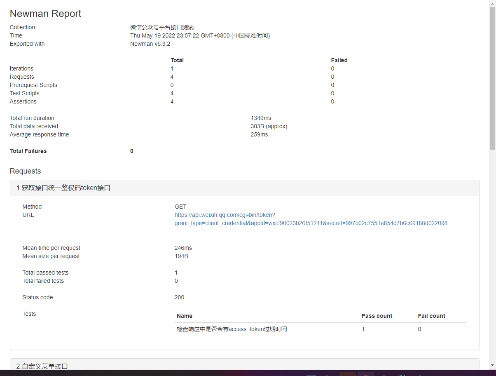

## 安装依赖
首先需要安装nodejs环境
再安装newman，以及生成报告需要的依赖
```
npm install newman -g

npm install newman-reporter-html -g
```

```
newman run postman_collection.json -e environment.json -r cli,html,json,junit --reporter-html-export report.html
```

## 生成的报告截图


